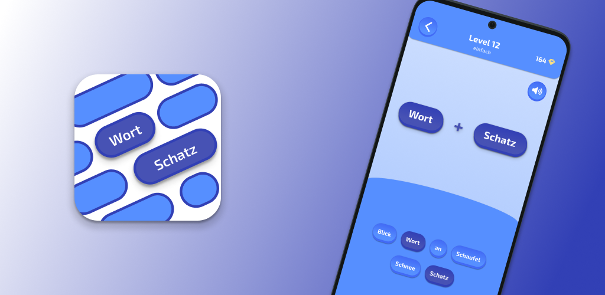

# 💎 Wort + Schatz: Wörter Suche

**Wort + Schatz** is a fun german word building app, where you have to combine words to valid compounds.
The app is written with Flutter (dart) and is currently available for Android on the Google Play Store ([here](https://play.google.com/store/apps/details?id=com.development_felber.compose&pli=1)).

  
  
  
  

## 📩 Feedback

You have a feature request, discovered a bug or any other kind of feedback?

- Reach out to me via email (development.felber@gmail.com),
- Write a review in the [Google Play Store](https://play.google.com/store/apps/details?id=com.development_felber.compose&pli=1),
- Or create an [issue here on GitHub](https://github.com/FelberMartin/kompositum/issues/new)
