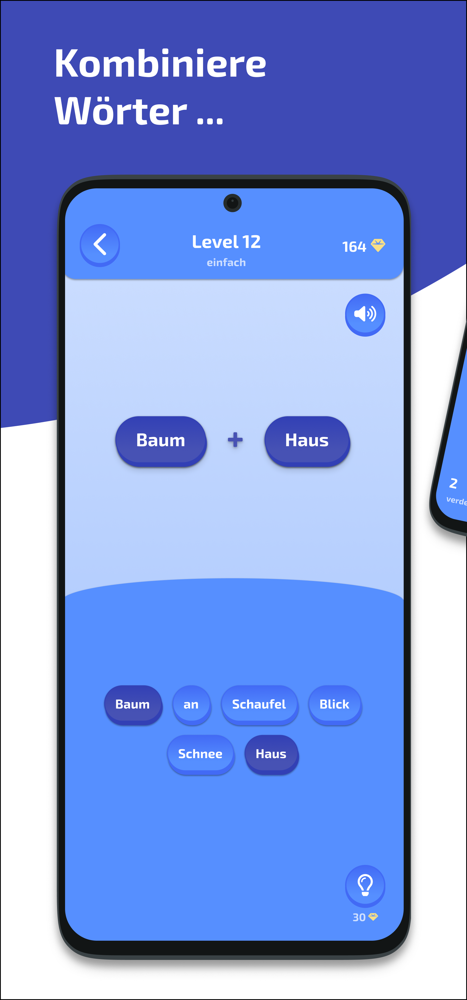
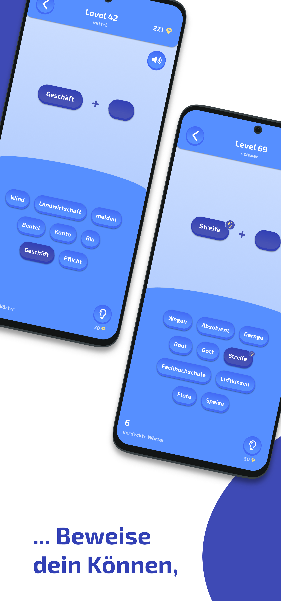
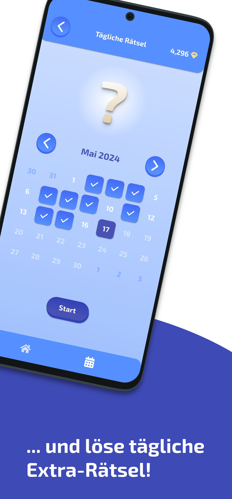

# 💎 Wort + Schatz: Wörter Suche

**Wort + Schatz** is a fun german word building app, where you have to combine words to valid compounds.
The app is written with Flutter (dart) and is available on 
the Google Play Store ([here](https://play.google.com/store/apps/details?id=com.development_felber.compose&pli=1)) 
and on the Apple AppStore ([here](https://apps.apple.com/app/wort-schatz-w%C3%B6rter-suche/id6526461190)).

  
  
  
  

## 📩 Feedback

You have a feature request, discovered a bug or any other kind of feedback?

- Reach out to me via email (development.felber@gmail.com),
- Write a review in the [Google Play Store](https://play.google.com/store/apps/details?id=com.development_felber.compose&pli=1),
- Or create an [issue here on GitHub](https://github.com/FelberMartin/kompositum/issues/new)
